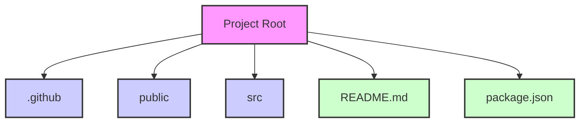

```mermaid
%%{ init : { "theme" : "default", "themeVariables": { "edgeColor": "#000000", "edgeWidth": "2", "nodeBorderRadius": "5px", "nodeBorderColor": "#000000", "nodeBorderWidth": "2", "nodeTextColor": "#000000", "nodeBackgroundColor": "#ffffff", "nodeTextColor": "#000000", "nodeFontSize": "14px", "edgeColor": "#007bff", "edgeFontSize": "12px" } } }%%
graph TD
    A[<b>Project Root</b>]:::root

    A1[.github]:::folder
    A2[.husky]:::folder
    A3[public]:::folder
    A4[src]:::folder
    A5[App.tsx]:::file
    A6[main.tsx]:::file
    A7[tailwind.css]:::file
    A8[vite-env.d.ts]:::file
    A9[.eslintignore]:::file
    A10[.eslintrc.cjs]:::file
    A11[.gitignore]:::file
    A12[LICENCE.md]:::file
    A13[README.md]:::file
    A14[SECURITY.md]:::file
    A15[cspell.json]:::file
    A16[index.html]:::file
    A17[package.json]:::file
    A18[pnpm-lock.yaml]:::file
    A19[postcss.config.js]:::file
    A20[tailwind.config.js]:::file
    A21[tsconfig.json]:::file
    A22[tsconfig.node.json]:::file
    A23[vite.config.ts]:::file

    A --> A1
    A --> A2
    A --> A3
    A --> A4
    A --> A5
    A --> A6
    A --> A7
    A --> A8
    A --> A9
    A --> A10
    A --> A11
    A --> A12
    A --> A13
    A --> A14
    A --> A15
    A --> A16
    A --> A17
    A --> A18
    A --> A19
    A --> A20
    A --> A21
    A --> A22
    A --> A23

    A1 --> A1_1[workflows]:::folder
    A1_1 --> A1_1_1[codeql.yml]:::file

    A2 --> A2_1[pre-commit]:::file

    A3 --> A3_1[vite.svg]:::file

    A4 --> A4_1[@types]:::folder
    A4_1 --> A4_1_1[commonTypes.ts]:::file
    A4 --> A4_2[assets]:::folder
    A4_2 --> A4_2_1[fonts]:::folder
    A4_2 --> A4_2_2[svg]:::folder
    A4_2_2 --> A4_2_2_1[react.svg]:::file
    A4 --> A4_3[styles]:::folder
    A4_3 --> A4_3_1[Container]:::folder
    A4_3_1 --> A4_3_1_1[index.css]:::file
    A4_3 --> A4_3_2[model]:::folder
    A4_3_2 --> A4_3_2_1[index.css]:::file
    A4_3 --> A4_3_3[index.css]:::file
    A4 --> A4_4[components]:::folder
    A4_4 --> A4_4_1[HOC]:::folder
    A4_4_1 --> A4_4_1_1[index.ts]:::file
    A4_4 --> A4_4_2[theme]:::folder
    A4_4_2 --> A4_4_2_1[index.ts]:::file
    A4_4_2 --> A4_4_2_2[theme-provider.tsx]:::file
    A4_4 --> A4_4_3[ui]:::folder
    A4_4_3 --> A4_4_3_1[Accordion]:::folder
    A4_4_3_1 --> A4_4_3_1_1[Accordion.tsx]:::file
    A4_4_3 --> A4_4_3_2[Avatar]:::folder
    A4_4_3_2 --> A4_4_3_2_1[Avatar.tsx]:::file
    A4_4_3 --> A4_4_3_3[Badge]:::folder
    A4_4_3_3 --> A4_4_3_3_1[Badge.tsx]:::file
    A4_4_3 --> A4_4_3_4[Block]:::folder
    A4_4_3_4 --> A4_4_3_4_1[Block.tsx]:::file
    A4_4_3 --> A4_4_3_5[Breadcrumb]:::folder
    A4_4_3_5 --> A4_4_3_5_1[Breadcrumb.tsx]:::file
    A4_4_3 --> A4_4_3_6[Button]:::folder
    A4_4_3_6 --> A4_4_3_6_1[button.tsx]:::file
    A4_4_3_6 --> A4_4_3_6_2[ButtonVariants.ts]:::file
    A4_4_3 --> A4_4_3_7[CheckBox]:::folder
    A4_4_3_7 --> A4_4_3_7_1[Checkbox.tsx]:::file
    A4_4_3 --> A4_4_3_8[Common]:::folder
    A4_4_3_8 --> A4_4_3_8_1[colors-blocks.ts]:::file
    A4_4_3 --> A4_4_3_9[ConfirmationDialog]:::folder
    A4_4_3_9 --> A4_4_3_9_1[ConfirmationDialog.tsx]:::file
    A4_4_3 --> A4_4_3_10[Container]:::folder
    A4_4_3_10 --> A4_4_3_10_1[Container.tsx]:::file
    A4_4_3 --> A4_4_3_11[ContextMenu]:::folder
    A4_4_3_11 --> A4_4_3_11_1[Contextmenu.tsx]:::file
    A4_4_3 --> A4_4_3_12[Flex]:::folder
    A4_4_3_12 --> A4_4_3_12_1[Flex.tsx]:::file
    A4_4_3_12 --> A4_4_3_12_2[style-object.ts]:::file
    A4_4_3 --> A4_4_3_13[Grid]:::folder
    A4_4_3_13 --> A4_4_3_13_1[GridItem]:::folder
    A4_4_3_13_1 --> A4_4_3_13_1_1[GridItem.tsx]:::file
    A4_4_3_13 --> A4_4_3_13_2[Grid.tsx]:::file
    A4_4_3_13_2 --> A4_4_3_13_2_1[style-object.ts]:::file
    A4_4_3 --> A4_4_3_14[HoverCard]:::folder
    A4_4_3_14 --> A4_4_3_14_1[HoverCard.tsx]:::file
    A4_4_3 --> A4_4_3_15[Model]:::folder
    A4_4_3_15 --> A4_4_3_15_1[Model.tsx]:::file
    A4_4_3_15 --> A4_4_3_15_2[model-variants.ts]:::file
    A4_4_3 --> A4_4_3_16[Separator]:::folder
    A4_4_3_16 --> A4_4_3_16_1[Separator.tsx]:::file
    A4_4_3 --> A4_4_3_17[Skeleton]:::folder
    A4_4_3_17 --> A4_4_3_17_1[Skeleton.tsx]:::file
    A4_4_3 --> A4_4_3_18[ToolTip]:::folder
    A4

_4_3_18 --> A4_4_3_18_1[ToolTip.tsx]:::file
    A4_4_3 --> A4_4_3_19[Typography]:::folder
    A4_4_3_19 --> A4_4_3_19_1[Typography.tsx]:::file
    A4_4_3_19 --> A4_4_3_19_2[TypographyClasses.ts]:::file
    A4_4_3_19 --> A4_4_3_19_3[text-color.ts]:::file
    A4_4_3 --> A4_4_3_20[types.ts]:::file
    A4_4_3 --> A4_4_3_21[className]:::folder
    A4_4_3_21 --> A4_4_3_21_1[index.ts]:::file
    A4_4 --> A4_5[hooks]:::folder
    A4_5 --> A4_5_1[useTheme]:::folder
    A4_5_1 --> A4_5_1_1[useTheme.ts]:::file
    A4_5 --> A4_5_2[index.ts]:::file
    A4 --> A4_6[shared]:::folder
    A4_6 --> A4_6_1[index.ts]:::file

    classDef root fill:#f9f,stroke:#333,stroke-width:2px;
    classDef folder fill:#ccf,stroke:#333,stroke-width:2px;
    classDef file fill:#cfc,stroke:#333,stroke-width:2px;
```




