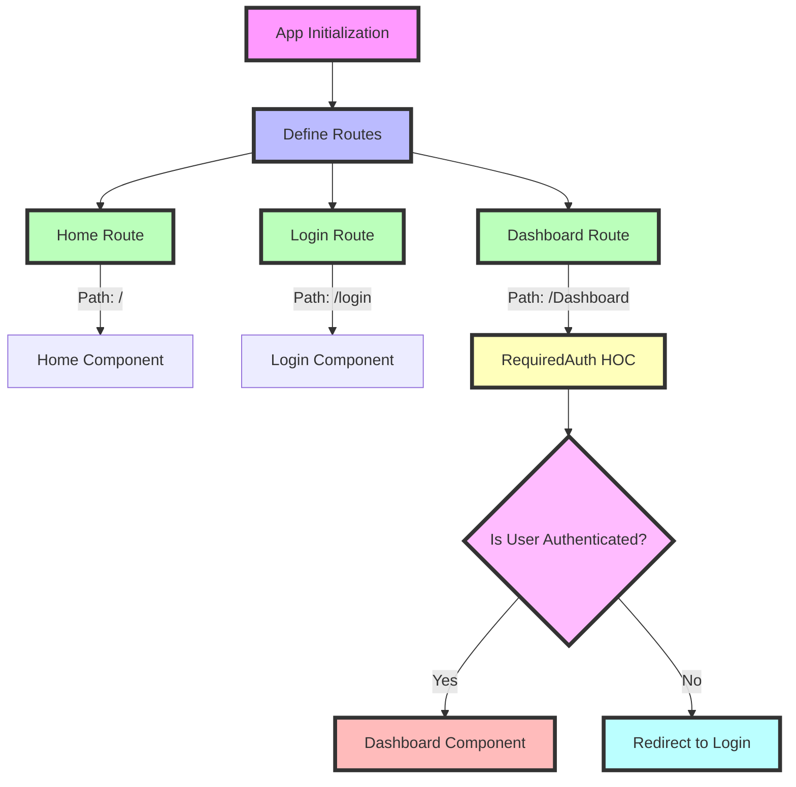

```
📁 public
 └── 📄 vite.svg
📁 src
 ├── 📁 assets
 │    └── 📄 react.svg
 ├── 📁 components
 │    ├── 📄 Allroutes.jsx
 │    └── 📄 Reject.jsx
 ├── 📁 hoc
 │    └── 📄 RequiredAuth.jsx
 ├── 📁 lang
 │    ├── 📄 eng.json
 │    └── 📄 hindi.json
 ├── 📁 store
 │    ├── 📁 auth
 │    │    ├── 📄 actions.js
 │    │    └── 📄 authReducer.js
 │    ├── 📁 reducer
 │    │    ├── 📄 Reducer.js
 │    │    └── 📄 actions.js
 │    └── 📄 Allactions.types.js
 │    └── 📄 store.js
 ├── 📄 Dashboard.jsx
 ├── 📄 Home.jsx
 ├── 📄 Login.jsx
 ├── 📄 Navbar.jsx
 ├── 📄 App.css
 ├── 📄 App.jsx
 ├── 📄 index.css
 ├── 📄 main.jsx
 └── 📄 .gitignore
 └── 📄 index.html
 └── 📄 package.json
 └── 📄 vite.config.js
 └── 📄 yarn.lock
```
---

### `vite.svg` and `react.svg`

1. **📁 public**
   - **📄 vite.svg**
     - This file typically contains the logo or an image related to the Vite.js tool. Vite is a build tool that aims to provide a faster and leaner development experience for modern web projects. The `vite.svg` file is usually used in the application for branding or as a placeholder during the development process.

2. **📁 src**
   - **📁 assets**
     - **📄 react.svg**
       - This file typically contains the logo or an image related to React. It's often used within the React application to display the React logo, perhaps on the home page or within a loading screen.

These SVG files are usually small graphics that are utilized within the application for visual representation, such as logos, icons, or other graphical elements.

###  📄 Allroutes.jsx


1. **Import Statements:**
    ```jsx
    import React from "react";
    import { Routes, Route, useNavigate } from "react-router-dom";
    import Home from "../view/Home";
    import Dashboard from "../view/Dashboard";
    import Login from "../view/Login";
    import { Box } from "@chakra-ui/react";
    import RequiredAuth from "../hoc/RequiredAuth";
    ```
    - **React**: Importing the core React library.
    - **react-router-dom**: Importing `Routes`, `Route`, and `useNavigate` for routing.
    - **Component Imports**: Importing `Home`, `Dashboard`, and `Login` components.
    - **Chakra UI**: Importing `Box` component from Chakra UI for layout styling.
    - **HOC (Higher-Order Component)**: Importing `RequiredAuth` to protect routes.

2. **Allroutes Component Definition:**
    ```jsx
    const Allroutes = () => {
    ```
    - Defining a functional component named `Allroutes`.

3. **Returning JSX:**
    ```jsx
    return (
      <Box marginTop="60px">
        <Routes>
          <Route path="/" element={<Home />} />
          <Route path="/login" element={<Login />} />
          <Route
            path="/Dashboard"
            element={
              <RequiredAuth>
                {" "}
                <Dashboard />
              </RequiredAuth>
            }
          />
        </Routes>
      </Box>
    );
    ```
    - **Box Component**: Wrapping the routes inside a `Box` component from Chakra UI, with a margin-top of 60px to provide spacing from the top.
    - **Routes**: Using the `Routes` component to define multiple `Route` components:
        - **Route 1**: 
            ```jsx
            <Route path="/" element={<Home />} />
            ```
            - Defines the root path (`/`) and renders the `Home` component.
        - **Route 2**:
            ```jsx
            <Route path="/login" element={<Login />} />
            ```
            - Defines the `/login` path and renders the `Login` component.
        - **Route 3**:
            ```jsx
            <Route
              path="/Dashboard"
              element={
                <RequiredAuth>
                  <Dashboard />
                </RequiredAuth>
              }
            />
            ```
            - Defines the `/Dashboard` path and renders the `Dashboard` component.
            - Wraps the `Dashboard` component inside the `RequiredAuth` HOC to protect this route. This means the `Dashboard` component will only be accessible if the `RequiredAuth` conditions are met.

4. **Exporting Allroutes:**
    ```jsx
    export default Allroutes;
    ```
    - Exporting the `Allroutes` component as the default export of this module.

### Summary
The `Allroutes.jsx` file defines a set of routes for a React application using `react-router-dom`. It imports necessary components and libraries, sets up routing with `Routes` and `Route`, and includes a higher-order component (`RequiredAuth`) to protect certain routes. The layout is styled using a `Box` component from Chakra UI with a margin at the top.


# Flowchart of `Allroutes.jsx`

The `Allroutes.jsx` component is responsible for routing in the application. Below is a detailed flowchart of how it works:

```
                                 ┌───────────────────┐
                                 │   Allroutes.jsx   │
                                 └────────┬──────────┘
                                          │
                                          ▼
                             ┌────────────────────────┐
                             │ <Box marginTop="60px"> │
                             └────────┬───────────────┘
                                      │
                                      ▼
                            ┌──────────────────────────┐
                            │        <Routes>          │
                            └─────────┬────────────────┘
                                      │
             ┌────────────────────────┼────────────────────────┐
             │                        │                        │
             ▼                        ▼                        ▼
 ┌────────────────────┐    ┌────────────────────┐    ┌───────────────────────┐
 │  <Route path="/"   │    │ <Route path="/login│    │ <Route path="/Dashboard│
 │   element={<Home   │    │  element={<Login   │    │ element={             │
 │   />} />           │    │  />} />            │    │   <RequiredAuth>      │
 └────────┬───────────┘    └────────┬───────────┘    │     <Dashboard />     │
          │                         │                │   </RequiredAuth>     │
          │                         │                └──────────┬────────────┘
          │                         │                           │
          │                         │                           ▼
          ▼                         ▼                ┌───────────────────────┐
┌────────────────────┐   ┌────────────────────┐      │     Authentication    │
│      Home.jsx      │   │      Login.jsx     │      │       Logic in        │
│  (Home Component)  │   │  (Login Component) │      │   RequiredAuth.jsx    │
└────────────────────┘   └────────────────────┘      │(Higher-Order Component)  
                                                     └───────────────────────┘
```


### Description

1. **Allroutes.jsx Component**: This is the main routing component.
2. **Box Component**: A layout component from Chakra UI with a top margin of 60px.
3. **Routes Component**: Contains all the route definitions.
4. **Route Definitions**:
   - **Route 1**: For the root path (`/`), renders the `Home` component.
   - **Route 2**: For the `/login` path, renders the `Login` component.
   - **Route 3**: For the `/Dashboard` path, renders the `Dashboard` component wrapped inside the `RequiredAuth` higher-order component.
5. **RequiredAuth Component**: Checks for authentication before rendering the `Dashboard` component.



